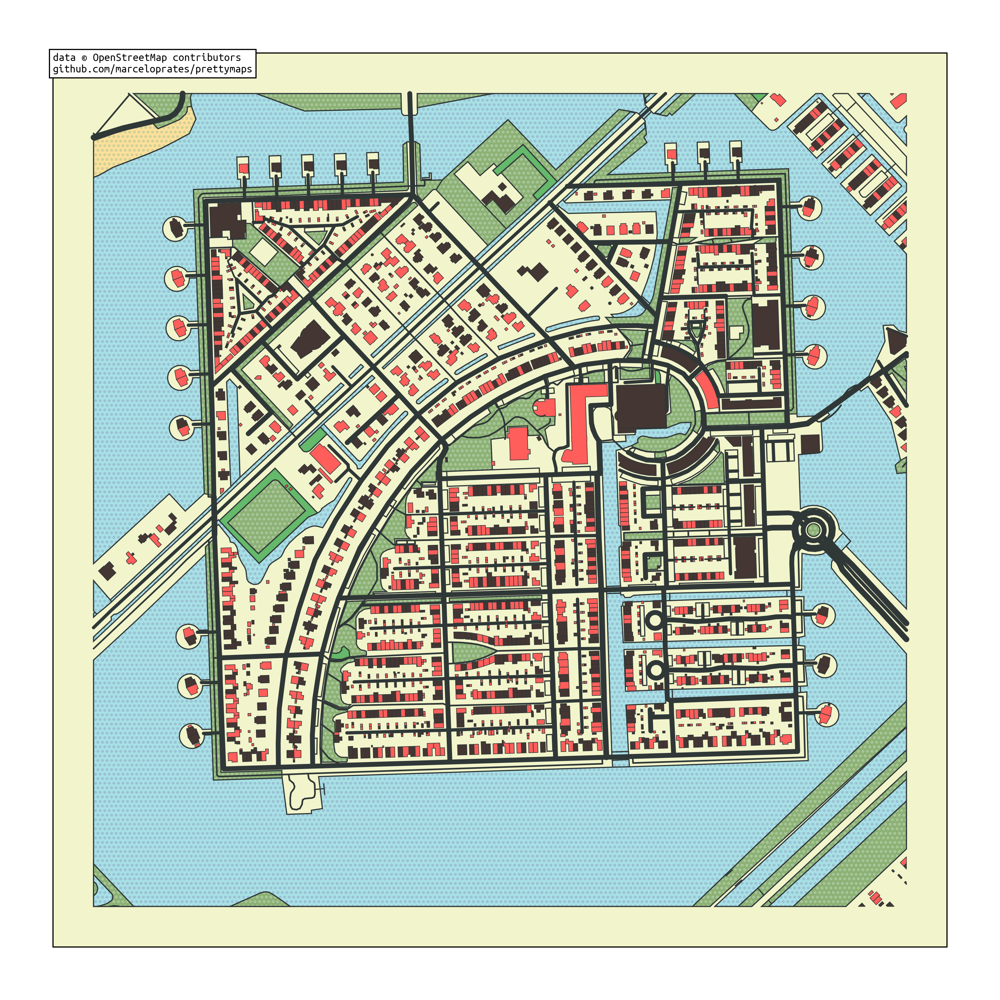
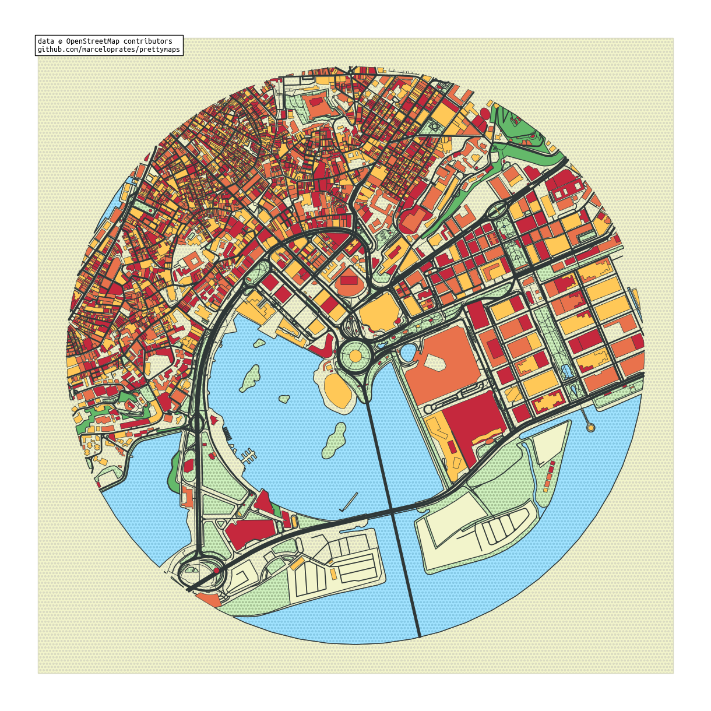
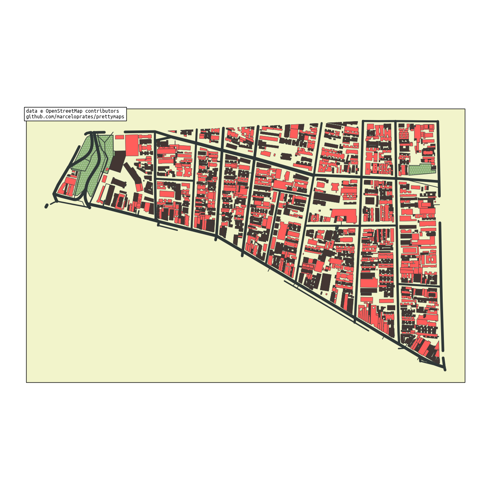
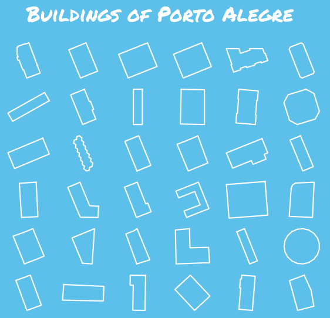
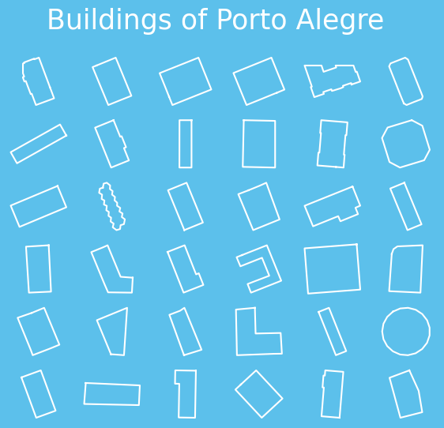
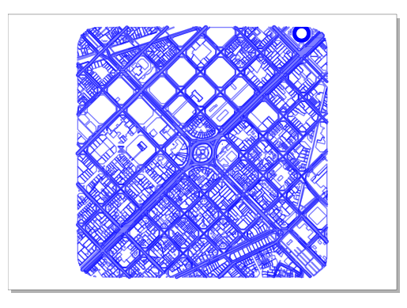
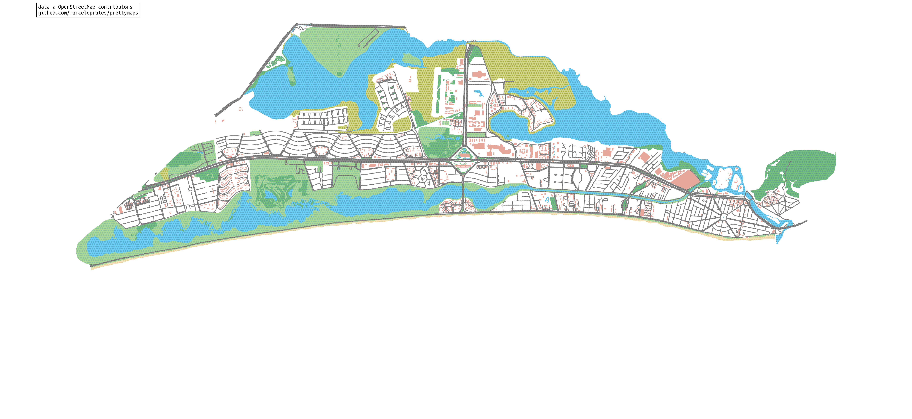

# prettymaps

A Python package to draw maps with customizable styles from [OpenStreetMap](https://www.openstreetmap.org/#map=12/11.0733/106.3078) data. Created using the [osmnx](https://github.com/gboeing/osmnx), [matplotlib](https://matplotlib.org/), [shapely](https://shapely.readthedocs.io/en/stable/index.html) and [vsketch](https://github.com/abey79/vsketch) packages.

> **This work is [licensed](LICENSE) under a GNU Affero General Public License v3.0 (you can make commercial use, distribute and modify this project, but must **disclose** the source code with the license and copyright notice)**

<a href='https://ko-fi.com/marceloprates_' target='_blank'></a>

# Installation

### Install using with [pip](https://pypi.org):

```
pip install prettymaps
```

# [Google Colab Demo](https://colab.research.google.com/github/marceloprates/prettymaps/blob/master/notebooks/examples.ipynb)


# Note about crediting and NFTs:
- Please keep the printed message on the figures crediting my repository and OpenStreetMap ([mandatory by their license](https://www.openstreetmap.org/copyright)).
- I am personally **against** NFTs for their [environmental impact](https://earth.org/nfts-environmental-impact/), the fact that they're a [giant money-laundering pyramid scheme](https://twitter.com/smdiehl/status/1445795667826208770) and the structural incentives they create for [theft](https://twitter.com/NFTtheft) in the open source and generative art communities.
- **I do not authorize in any way this project to be used for selling NFTs**, although I cannot legally enforce it. **Respect the creator**.
- The [AeternaCivitas](https://magiceden.io/marketplace/aeterna_civitas) and [geoartnft](https://www.geo-nft.com/) projects have used this work to sell NFTs and refused to credit it. See how they reacted after being exposed: [AeternaCivitas](etc/NFT_theft_AeternaCivitas.jpg), [geoartnft](etc/NFT_theft_geoart.jpg).
- **I have closed my other generative art projects on Github and won't be sharing new ones as open source to protect me from the NFT community**.

# As seen on [Hacker News](https://web.archive.org/web/20210825160918/https://news.ycombinator.com/news):


# [prettymaps subreddit](https://www.reddit.com/r/prettymaps_/)


# Tutorial

Plotting with prettymaps is very simple. Run:
```python
prettymaps.plot(your_query)
```

**your_query** can be:
1. An address (Example: "Porto Alegre"),
2. Latitude / Longitude coordinates (Example: (-30.0324999, -51.2303767))
3. A custom boundary in GeoDataFrame format


```python
import prettymaps

plot = prettymaps.plot('Stad van de Zon, Heerhugowaard, Netherlands')
```


    

    


You can also choose from different "presets" (parameter combinations saved in JSON files)

See below an example using the "minimal" preset


```python
plot = prettymaps.plot(
    'Stad van de Zon, Heerhugowaard, Netherlands',
    preset = 'minimal'
)
```


    

    


Run

```python
prettymaps.presets()
```

to list all available presets:

<div>
<table border="1" class="dataframe">
  <thead>
    <tr style="text-align: right;">
      <th></th>
      <th>preset</th>
      <th>params</th>
    </tr>
  </thead>
  <tbody>
    <tr>
      <th>0</th>
      <td>barcelona</td>
      <td>{'layers': {'perimeter': {'circle': False}, 's...</td>
    </tr>
    <tr>
      <th>1</th>
      <td>barcelona-plotter</td>
      <td>{'layers': {'streets': {'width': {'primary': 5...</td>
    </tr>
    <tr>
      <th>2</th>
      <td>cb-bf-f</td>
      <td>{'layers': {'streets': {'width': {'trunk': 6, ...</td>
    </tr>
    <tr>
      <th>3</th>
      <td>default</td>
      <td>{'layers': {'perimeter': {}, 'streets': {'widt...</td>
    </tr>
    <tr>
      <th>4</th>
      <td>heerhugowaard</td>
      <td>{'layers': {'perimeter': {}, 'streets': {'widt...</td>
    </tr>
    <tr>
      <th>5</th>
      <td>macao</td>
      <td>{'layers': {'perimeter': {}, 'streets': {'cust...</td>
    </tr>
    <tr>
      <th>6</th>
      <td>minimal</td>
      <td>{'layers': {'perimeter': {}, 'streets': {'widt...</td>
    </tr>
    <tr>
      <th>7</th>
      <td>tijuca</td>
      <td>{'layers': {'perimeter': {}, 'streets': {'widt...</td>
    </tr>
  </tbody>
</table>
</div>


To examine a specific preset, run:


```python
prettymaps.preset('default')
```


|            | layers                                                                                                                                                                                                          | style                                                                                                                                                                                                                                                                         | circle          | radius         |
|:-----------|:----------------------------------------------------------------------------------------------------------------------------------------------------------------------------------------------------------------|:------------------------------------------------------------------------------------------------------------------------------------------------------------------------------------------------------------------------------------------------------------------------------|:----------------|:---------------|
| perimeter  | {}<br>                                                                                                                                                                                                          | fill: false<br>lw: 0<br>zorder: 0<br>                                                                                                                                                                                                                                         | null<br>...<br> | 500<br>...<br> |
| streets    | width:<br>  cycleway: 3.5<br>  footway: 1<br>  motorway: 5<br>  pedestrian: 2<br>  primary: 4.5<br>  residential: 3<br>  secondary: 4<br>  service: 2<br>  tertiary: 3.5<br>  trunk: 5<br>  unclassified: 2<br> | alpha: 1<br>ec: '<span style="background-color:#475657; color:#fff">#475657</span>'<br>fc: '<span style="background-color:#2F3737; color:#fff">#2F3737</span>'<br>lw: 0<br>zorder: 4<br>                                                                                      |                 |                |
| building   | tags:<br>  building: true<br>  landuse: construction<br>                                                                                                                                                        | ec: '<span style="background-color:#2F3737; color:#fff">#2F3737</span>'<br>lw: 0.5<br>palette:<br>- '<span style="background-color:#433633; color:#fff">#433633</span>'<br>- '<span style="background-color:#FF5E5B; color:#000">#FF5E5B</span>'<br>zorder: 5<br>             |                 |                |
| water      | tags:<br>  natural:<br>  - water<br>  - bay<br>                                                                                                                                                                 | ec: '<span style="background-color:#2F3737; color:#fff">#2F3737</span>'<br>fc: '<span style="background-color:#a8e1e6; color:#000">#a8e1e6</span>'<br>hatch: ooo...<br>hatch_c: '<span style="background-color:#9bc3d4; color:#000">#9bc3d4</span>'<br>lw: 1<br>zorder: 3<br> |                 |                |
| forest     | tags:<br>  landuse: forest<br>                                                                                                                                                                                  | ec: '<span style="background-color:#2F3737; color:#fff">#2F3737</span>'<br>fc: '<span style="background-color:#64B96A; color:#000">#64B96A</span>'<br>lw: 1<br>zorder: 2<br>                                                                                                  |                 |                |
| green      | tags:<br>  landuse:<br>  - grass<br>  - orchard<br>  leisure: park<br>  natural:<br>  - island<br>  - wood<br>                                                                                                  | ec: '<span style="background-color:#2F3737; color:#fff">#2F3737</span>'<br>fc: '<span style="background-color:#8BB174; color:#000">#8BB174</span>'<br>hatch: ooo...<br>hatch_c: '<span style="background-color:#A7C497; color:#000">#A7C497</span>'<br>lw: 1<br>zorder: 1<br> |                 |                |
| beach      | tags:<br>  natural: beach<br>                                                                                                                                                                                   | ec: '<span style="background-color:#2F3737; color:#fff">#2F3737</span>'<br>fc: '<span style="background-color:#FCE19C; color:#000">#FCE19C</span>'<br>hatch: ooo...<br>hatch_c: '<span style="background-color:#d4d196; color:#000">#d4d196</span>'<br>lw: 1<br>zorder: 3<br> |                 |                |
| parking    | tags:<br>  amenity: parking<br>  highway: pedestrian<br>  man_made: pier<br>                                                                                                                                    | ec: '<span style="background-color:#2F3737; color:#fff">#2F3737</span>'<br>fc: '<span style="background-color:#F2F4CB; color:#000">#F2F4CB</span>'<br>lw: 1<br>zorder: 3<br>                                                                                                  |                 |                |
| background | .nan<br>...<br>                                                                                                                                                                                                 | fc: '<span style="background-color:#F2F4CB; color:#000">#F2F4CB</span>'<br>zorder: -1<br>                                                                                                                                                                                     |                 |                |


Insted of using the default configuration you can customize several parameters. The most important are:

- layers: A dictionary of OpenStreetMap layers to fetch.
    - Keys: layer names (arbitrary)
    - Values: dicts representing OpenStreetMap queries
- style: Matplotlib style parameters
    - Keys: layer names (the same as before)
    - Values: dicts representing Matplotlib style parameters

```python
plot = prettymaps.plot(
    # Your query. Example: "Porto Alegre" or (-30.0324999, -51.2303767) (GPS coords)
    your_query,
    # Dict of OpenStreetMap Layers to plot. Example:
    # {'building': {'tags': {'building': True}}, 'water': {'tags': {'natural': 'water'}}}
    # Check the /presets folder for more examples
    layers,
    # Dict of style parameters for matplotlib. Example:
    # {'building': {'palette': ['#f00','#0f0','#00f'], 'edge_color': '#333'}}
    style,
    # Preset to load. Options include:
    # ['default', 'minimal', 'macao', 'tijuca']
    preset,
    # Save current parameters to a preset file.
    # Example: "my-preset" will save to "presets/my-preset.json"
    save_preset,
    # Whether to update loaded preset with additional provided parameters. Boolean
    update_preset,
    # Plot with circular boundary. Boolean
    circle,
    # Plot area radius. Float
    radius,
    # Dilate the boundary by this amount. Float
    dilate
)
```

**plot** is a python dataclass containing:

```python
@dataclass
class Plot:
    # A dictionary of GeoDataFrames (one for each plot layer)
    geodataframes: Dict[str, gp.GeoDataFrame]
    # A matplotlib figure
    fig: matplotlib.figure.Figure
    # A matplotlib axis object
    ax: matplotlib.axes.Axes
```

Here's an example of running prettymaps.plot() with customized parameters:


```python
plot = prettymaps.plot(
    'Praça Ferreira do Amaral, Macau',
    circle = True,
    radius = 1100,
    layers = {
        "green": {
            "tags": {
                "landuse": "grass",
                "natural": ["island", "wood"],
                "leisure": "park"
            }
        },
        "forest": {
            "tags": {
                "landuse": "forest"
            }
        },
        "water": {
            "tags": {
                "natural": ["water", "bay"]
            }
        },
        "parking": {
            "tags": {
                "amenity": "parking",
                "highway": "pedestrian",
                "man_made": "pier"
            }
        },
        "streets": {
            "width": {
                "motorway": 5,
                "trunk": 5,
                "primary": 4.5,
                "secondary": 4,
                "tertiary": 3.5,
                "residential": 3,
            }
        },
        "building": {
            "tags": {"building": True},
        },
    },
    style = {
        "background": {
            "fc": "#F2F4CB",
            "ec": "#dadbc1",
            "hatch": "ooo...",
        },
        "perimeter": {
            "fc": "#F2F4CB",
            "ec": "#dadbc1",
            "lw": 0,
            "hatch": "ooo...",
        },
        "green": {
            "fc": "#D0F1BF",
            "ec": "#2F3737",
            "lw": 1,
        },
        "forest": {
            "fc": "#64B96A",
            "ec": "#2F3737",
            "lw": 1,
        },
        "water": {
            "fc": "#a1e3ff",
            "ec": "#2F3737",
            "hatch": "ooo...",
            "hatch_c": "#85c9e6",
            "lw": 1,
        },
        "parking": {
            "fc": "#F2F4CB",
            "ec": "#2F3737",
            "lw": 1,
        },
        "streets": {
            "fc": "#2F3737",
            "ec": "#475657",
            "alpha": 1,
            "lw": 0,
        },
        "building": {
            "palette": [
                "#FFC857",
                "#E9724C",
                "#C5283D"
            ],
            "ec": "#2F3737",
            "lw": 0.5,
        }
    }
)
```


    

    


In order to plot an entire region and not just a rectangular or circular area, set

```python
radius = False
```


```python
plot = prettymaps.plot(
    'Bom Fim, Porto Alegre, Brasil', radius = False,
)
```


   
You can access layers's GeoDataFrames directly like this:

```python
# Run prettymaps in show = False mode (we're only interested in obtaining the GeoDataFrames)
plot = prettymaps.plot('Centro Histórico, Porto Alegre', show = False)
plot.geodataframes['building']
```

<div>
<table border="1" class="dataframe">
  <thead>
    <tr style="text-align: right;">
      <th></th>
      <th></th>
      <th>addr:housenumber</th>
      <th>addr:street</th>
      <th>amenity</th>
      <th>operator</th>
      <th>website</th>
      <th>geometry</th>
      <th>addr:postcode</th>
      <th>name</th>
      <th>office</th>
      <th>opening_hours</th>
      <th>...</th>
      <th>contact:phone</th>
      <th>bus</th>
      <th>public_transport</th>
      <th>source:name</th>
      <th>government</th>
      <th>ways</th>
      <th>name:fr</th>
      <th>type</th>
      <th>building:part</th>
      <th>architect</th>
    </tr>
    <tr>
      <th>element_type</th>
      <th>osmid</th>
      <th></th>
      <th></th>
      <th></th>
      <th></th>
      <th></th>
      <th></th>
      <th></th>
      <th></th>
      <th></th>
      <th></th>
      <th></th>
      <th></th>
      <th></th>
      <th></th>
      <th></th>
      <th></th>
      <th></th>
      <th></th>
      <th></th>
      <th></th>
      <th></th>
    </tr>
  </thead>
  <tbody>
    <tr>
      <th>node</th>
      <th>2407915698</th>
      <td>820</td>
      <td>Rua Washington Luiz</td>
      <td>NaN</td>
      <td>NaN</td>
      <td>NaN</td>
      <td>POINT (-51.23212 -30.03670)</td>
      <td>90010-460</td>
      <td>NaN</td>
      <td>NaN</td>
      <td>NaN</td>
      <td>...</td>
      <td>NaN</td>
      <td>NaN</td>
      <td>NaN</td>
      <td>NaN</td>
      <td>NaN</td>
      <td>NaN</td>
      <td>NaN</td>
      <td>NaN</td>
      <td>NaN</td>
      <td>NaN</td>
    </tr>
    <tr>
      <th rowspan="4" valign="top">way</th>
      <th>126665330</th>
      <td>387</td>
      <td>Rua dos Andradas</td>
      <td>place_of_worship</td>
      <td>NaN</td>
      <td>NaN</td>
      <td>POLYGON ((-51.23518 -30.03275, -51.23512 -30.0...</td>
      <td>90020-002</td>
      <td>Igreja Nossa Senhora das Dores</td>
      <td>NaN</td>
      <td>NaN</td>
      <td>...</td>
      <td>NaN</td>
      <td>NaN</td>
      <td>NaN</td>
      <td>NaN</td>
      <td>NaN</td>
      <td>NaN</td>
      <td>NaN</td>
      <td>NaN</td>
      <td>NaN</td>
      <td>NaN</td>
    </tr>
    <tr>
      <th>126665331</th>
      <td>1001</td>
      <td>Rua dos Andradas</td>
      <td>NaN</td>
      <td>NaN</td>
      <td>http://www.ruadapraiashopping.com.br</td>
      <td>POLYGON ((-51.23167 -30.03066, -51.23160 -30.0...</td>
      <td>90020-015</td>
      <td>Rua da Praia Shopping</td>
      <td>NaN</td>
      <td>Mo-Fr 09:00-21:00; Sa 08:00-20:00</td>
      <td>...</td>
      <td>NaN</td>
      <td>NaN</td>
      <td>NaN</td>
      <td>NaN</td>
      <td>NaN</td>
      <td>NaN</td>
      <td>NaN</td>
      <td>NaN</td>
      <td>NaN</td>
      <td>NaN</td>
    </tr>
    <tr>
      <th>129176990</th>
      <td>1020</td>
      <td>Rua 7 de Setembro</td>
      <td>NaN</td>
      <td>NaN</td>
      <td>http://www.memorial.rs.gov.br</td>
      <td>POLYGON ((-51.23117 -30.02891, -51.23120 -30.0...</td>
      <td>90010-191</td>
      <td>Memorial do Rio Grande do Sul</td>
      <td>NaN</td>
      <td>Tu-Sa 10:00-18:00</td>
      <td>...</td>
      <td>NaN</td>
      <td>NaN</td>
      <td>NaN</td>
      <td>NaN</td>
      <td>NaN</td>
      <td>NaN</td>
      <td>NaN</td>
      <td>NaN</td>
      <td>NaN</td>
      <td>NaN</td>
    </tr>
    <tr>
      <th>129176991</th>
      <td>NaN</td>
      <td>Praça da Alfândega</td>
      <td>NaN</td>
      <td>NaN</td>
      <td>http://www.margs.rs.gov.br</td>
      <td>POLYGON ((-51.23153 -30.02914, -51.23156 -30.0...</td>
      <td>90010-150</td>
      <td>Museu de Arte do Rio Grande do Sul</td>
      <td>NaN</td>
      <td>Tu-Su 10:00-19:00</td>
      <td>...</td>
      <td>NaN</td>
      <td>NaN</td>
      <td>NaN</td>
      <td>NaN</td>
      <td>NaN</td>
      <td>NaN</td>
      <td>NaN</td>
      <td>NaN</td>
      <td>NaN</td>
      <td>NaN</td>
    </tr>
    <tr>
      <th>...</th>
      <th>...</th>
      <td>...</td>
      <td>...</td>
      <td>...</td>
      <td>...</td>
      <td>...</td>
      <td>...</td>
      <td>...</td>
      <td>...</td>
      <td>...</td>
      <td>...</td>
      <td>...</td>
      <td>...</td>
      <td>...</td>
      <td>...</td>
      <td>...</td>
      <td>...</td>
      <td>...</td>
      <td>...</td>
      <td>...</td>
      <td>...</td>
      <td>...</td>
    </tr>
    <tr>
      <th rowspan="5" valign="top">relation</th>
      <th>6760281</th>
      <td>NaN</td>
      <td>NaN</td>
      <td>NaN</td>
      <td>NaN</td>
      <td>NaN</td>
      <td>POLYGON ((-51.23238 -30.03337, -51.23223 -30.0...</td>
      <td>NaN</td>
      <td>NaN</td>
      <td>NaN</td>
      <td>NaN</td>
      <td>...</td>
      <td>NaN</td>
      <td>NaN</td>
      <td>NaN</td>
      <td>NaN</td>
      <td>NaN</td>
      <td>[457506887, 457506886]</td>
      <td>NaN</td>
      <td>multipolygon</td>
      <td>NaN</td>
      <td>NaN</td>
    </tr>
    <tr>
      <th>6760282</th>
      <td>NaN</td>
      <td>NaN</td>
      <td>NaN</td>
      <td>NaN</td>
      <td>NaN</td>
      <td>POLYGON ((-51.23203 -30.03340, -51.23203 -30.0...</td>
      <td>NaN</td>
      <td>Atheneu Espírita Cruzeiro do Sul</td>
      <td>NaN</td>
      <td>NaN</td>
      <td>...</td>
      <td>NaN</td>
      <td>NaN</td>
      <td>NaN</td>
      <td>NaN</td>
      <td>NaN</td>
      <td>[457506875, 457506889, 457506888]</td>
      <td>NaN</td>
      <td>multipolygon</td>
      <td>NaN</td>
      <td>NaN</td>
    </tr>
    <tr>
      <th>6760283</th>
      <td>NaN</td>
      <td>NaN</td>
      <td>NaN</td>
      <td>NaN</td>
      <td>NaN</td>
      <td>POLYGON ((-51.23284 -30.03367, -51.23288 -30.0...</td>
      <td>NaN</td>
      <td>Palacete Chaves</td>
      <td>NaN</td>
      <td>NaN</td>
      <td>...</td>
      <td>NaN</td>
      <td>NaN</td>
      <td>NaN</td>
      <td>NaN</td>
      <td>NaN</td>
      <td>[457506897, 457506896]</td>
      <td>NaN</td>
      <td>multipolygon</td>
      <td>NaN</td>
      <td>Theodor Wiederspahn</td>
    </tr>
    <tr>
      <th>6760284</th>
      <td>NaN</td>
      <td>NaN</td>
      <td>NaN</td>
      <td>NaN</td>
      <td>NaN</td>
      <td>POLYGON ((-51.23499 -30.03412, -51.23498 -30.0...</td>
      <td>NaN</td>
      <td>NaN</td>
      <td>NaN</td>
      <td>NaN</td>
      <td>...</td>
      <td>NaN</td>
      <td>NaN</td>
      <td>NaN</td>
      <td>NaN</td>
      <td>NaN</td>
      <td>[457506910, 457506913]</td>
      <td>NaN</td>
      <td>multipolygon</td>
      <td>NaN</td>
      <td>NaN</td>
    </tr>
    <tr>
      <th>14393526</th>
      <td>1044</td>
      <td>Rua Siqueira Campos</td>
      <td>NaN</td>
      <td>NaN</td>
      <td>https://www.sefaz.rs.gov.br</td>
      <td>POLYGON ((-51.23125 -30.02813, -51.23128 -30.0...</td>
      <td>NaN</td>
      <td>Secretaria Estadual da Fazenda</td>
      <td>NaN</td>
      <td>NaN</td>
      <td>...</td>
      <td>NaN</td>
      <td>NaN</td>
      <td>NaN</td>
      <td>NaN</td>
      <td>NaN</td>
      <td>[236213286, 1081974882]</td>
      <td>NaN</td>
      <td>multipolygon</td>
      <td>NaN</td>
      <td>NaN</td>
    </tr>
  </tbody>
</table>
<p>2423 rows × 105 columns</p>
</div>


Search a building by name and display it:


```python
plot.geodataframes['building'][
        plot.geodataframes['building'].name == 'Catedral Metropolitana Nossa Senhora Mãe de Deus'
].geometry[0]
```


    

    


Plot mosaic of building footprints


```python
import numpy as np
import osmnx as ox
from matplotlib import pyplot as plt
from matplotlib.font_manager import FontProperties

# Run prettymaps in show = False mode (we're only interested in obtaining the GeoDataFrames)
plot = prettymaps.plot('Porto Alegre', show = False)
# Get list of buildings from plot's geodataframes dict
buildings = plot.geodataframes['building']
# Project from lat / long
buildings = ox.project_gdf(buildings)
buildings = [b for b in buildings.geometry if b.area > 0]

# Draw Matplotlib mosaic of n x n building footprints
n = 6
fig,axes = plt.subplots(n,n, figsize = (7,6))
# Set background color
fig.patch.set_facecolor('#5cc0eb')
# Figure title
fig.suptitle(
    'Buildings of Porto Alegre',
    size = 25,
    color = '#fff',
    fontproperties = FontProperties(fname = '../assets/PermanentMarker-Regular.ttf')
)
# Draw each building footprint on a separate axis
for ax,building in zip(np.concatenate(axes),buildings):
    ax.plot(*building.exterior.xy, c = '#ffffff')
    ax.autoscale(); ax.axis('off'); ax.axis('equal')
```


    

    


Access plot.ax or plot.fig to add new elements to the matplotlib plot: 


```python
from matplotlib.font_manager import FontProperties

plot = prettymaps.plot(
    (41.39491,2.17557),
    preset = 'barcelona',
)

# Change background color
plot.fig.patch.set_facecolor('#F2F4CB')
# Add title
plot.ax.set_title(
    'Barcelona',
    fontproperties = FontProperties(
        fname = '../assets/PermanentMarker-Regular.ttf',
        size = 50
    )
)

plt.show()
```


    

    


Use **plotter** mode to export a pen plotter-compatible SVG (thanks to abey79's amazing [vsketch](https://github.com/abey79/vsketch) library)


```python
plot = prettymaps.plot(
    (41.39491,2.17557),
    mode = 'plotter',
    layers = dict(perimeter = {}),
    preset = 'barcelona-plotter',
    scale_x = .6,
    scale_y = -.6,
)
```


    

    


Some other examples


```python
plot = prettymaps.plot(
    # City name
    'Barra da Tijuca',
    dilate = 0,
    figsize = (22,10),
    preset = 'tijuca',
)
```


    

    


```python
plot = prettymaps.plot(
    'Stad van de Zon, Heerhugowaard, Netherlands',
    preset = 'heerhugowaard',
)
```


    

    


Use prettymaps.create_preset() to create a preset:


```python
prettymaps.create_preset(
    "my-preset",
    layers = {
        "building": {
            "tags": {
                "building": True,
                "leisure": [
                    "track",
                    "pitch"
                ]
            }
        },
        "streets": {
            "width": {
                "trunk": 6,
                "primary": 6,
                "secondary": 5,
                "tertiary": 4,
                "residential": 3.5,
                "pedestrian": 3,
                "footway": 3,
                "path": 3
            }
        },
    },
    style = {
        "perimeter": {
            "fill": False,
            "lw": 0,
            "zorder": 0
        },
        "streets": {
            "fc": "#F1E6D0",
            "ec": "#2F3737",
            "lw": 1.5,
            "zorder": 3
        },
        "building": {
            "palette": [
                "#fff"
            ],
            "ec": "#2F3737",
            "lw": 1,
            "zorder": 4
        }
    }
)

prettymaps.preset('my-preset')
```


|           | layers                                                                                                                                            | style                                                                                                                                                                                                                                   | circle          | radius          | dilate          |
|:----------|:--------------------------------------------------------------------------------------------------------------------------------------------------|:----------------------------------------------------------------------------------------------------------------------------------------------------------------------------------------------------------------------------------------|:----------------|:----------------|:----------------|
| building  | tags:<br>  building: true<br>  leisure:<br>  - track<br>  - pitch<br>                                                                             | ec: '<span style="background-color:#2F3737; color:<span style="background-color:#fff; color:#000">#fff</span>">#2F3737</span>'<br>lw: 1<br>palette:<br>- '<span style="background-color:#fff; color:#000">#fff</span>'<br>zorder: 4<br> | null<br>...<br> | null<br>...<br> | null<br>...<br> |
| streets   | width:<br>  footway: 3<br>  path: 3<br>  pedestrian: 3<br>  primary: 6<br>  residential: 3.5<br>  secondary: 5<br>  tertiary: 4<br>  trunk: 6<br> | ec: '<span style="background-color:#2F3737; color:#fff">#2F3737</span>'<br>fc: '<span style="background-color:#F1E6D0; color:#000">#F1E6D0</span>'<br>lw: 1.5<br>zorder: 3<br>                                                          |                 |                 |                 |
| perimeter | .nan<br>...<br>                                                                                                                                   | fill: false<br>lw: 0<br>zorder: 0<br>                                                                                                                                                                                                   |                 |                 |                 |


Use prettymaps.delete_preset() to delete presets:


```python
# Show presets before deletion
print('Before deletion:')
display(prettymaps.presets())
# Delete 'my-preset'
prettymaps.delete_preset('my-preset')
# Show presets after deletion
print('After deletion:')
display(prettymaps.presets())
```

    Before deletion:


<div>
<table border="1" class="dataframe">
  <thead>
    <tr style="text-align: right;">
      <th></th>
      <th>preset</th>
      <th>params</th>
    </tr>
  </thead>
  <tbody>
    <tr>
      <th>0</th>
      <td>barcelona</td>
      <td>{'layers': {'perimeter': {'circle': False}, 's...</td>
    </tr>
    <tr>
      <th>1</th>
      <td>barcelona-plotter</td>
      <td>{'layers': {'streets': {'width': {'primary': 5...</td>
    </tr>
    <tr>
      <th>2</th>
      <td>cb-bf-f</td>
      <td>{'layers': {'streets': {'width': {'trunk': 6, ...</td>
    </tr>
    <tr>
      <th>3</th>
      <td>default</td>
      <td>{'layers': {'perimeter': {}, 'streets': {'widt...</td>
    </tr>
    <tr>
      <th>4</th>
      <td>heerhugowaard</td>
      <td>{'layers': {'perimeter': {}, 'streets': {'widt...</td>
    </tr>
    <tr>
      <th>5</th>
      <td>macao</td>
      <td>{'layers': {'perimeter': {}, 'streets': {'cust...</td>
    </tr>
    <tr>
      <th>6</th>
      <td>minimal</td>
      <td>{'layers': {'perimeter': {}, 'streets': {'widt...</td>
    </tr>
    <tr>
      <th>7</th>
      <td>my-preset</td>
      <td>{'layers': {'building': {'tags': {'building': ...</td>
    </tr>
    <tr>
      <th>8</th>
      <td>tijuca</td>
      <td>{'layers': {'perimeter': {}, 'streets': {'widt...</td>
    </tr>
  </tbody>
</table>
</div>


    After deletion:


<div>
<table border="1" class="dataframe">
  <thead>
    <tr style="text-align: right;">
      <th></th>
      <th>preset</th>
      <th>params</th>
    </tr>
  </thead>
  <tbody>
    <tr>
      <th>0</th>
      <td>barcelona</td>
      <td>{'layers': {'perimeter': {'circle': False}, 's...</td>
    </tr>
    <tr>
      <th>1</th>
      <td>barcelona-plotter</td>
      <td>{'layers': {'streets': {'width': {'primary': 5...</td>
    </tr>
    <tr>
      <th>2</th>
      <td>cb-bf-f</td>
      <td>{'layers': {'streets': {'width': {'trunk': 6, ...</td>
    </tr>
    <tr>
      <th>3</th>
      <td>default</td>
      <td>{'layers': {'perimeter': {}, 'streets': {'widt...</td>
    </tr>
    <tr>
      <th>4</th>
      <td>heerhugowaard</td>
      <td>{'layers': {'perimeter': {}, 'streets': {'widt...</td>
    </tr>
    <tr>
      <th>5</th>
      <td>macao</td>
      <td>{'layers': {'perimeter': {}, 'streets': {'cust...</td>
    </tr>
    <tr>
      <th>6</th>
      <td>minimal</td>
      <td>{'layers': {'perimeter': {}, 'streets': {'widt...</td>
    </tr>
    <tr>
      <th>7</th>
      <td>tijuca</td>
      <td>{'layers': {'perimeter': {}, 'streets': {'widt...</td>
    </tr>
  </tbody>
</table>
</div>


Use **prettymaps.multiplot** and **prettymaps.Subplot** to draw multiple regions on the same canvas


```python
# Draw several regions on the same canvas
prettymaps.multiplot(
    prettymaps.Subplot(
        'Cidade Baixa, Porto Alegre',
        style={'building': {'palette': ['#49392C', '#E1F2FE', '#98D2EB']}}
    ),
    prettymaps.Subplot(
        'Bom Fim, Porto Alegre',
        style={'building': {'palette': ['#BA2D0B', '#D5F2E3', '#73BA9B', '#F79D5C']}}
    ),
    prettymaps.Subplot(
        'Farroupilha, Porto Alegre',
        style={'building': {'palette': ['#EEE4E1', '#E7D8C9', '#E6BEAE']}}
    ),
    # Load a global preset
    preset='cb-bf-f',
    # Figure size
    figsize=(12, 12)
)

```


    

    

