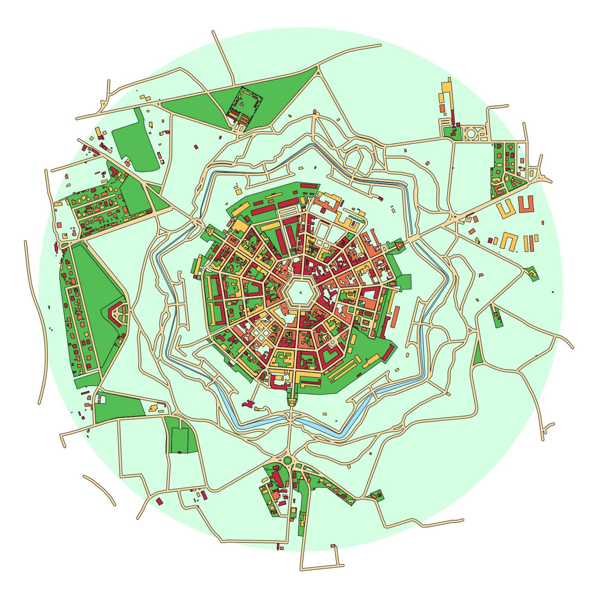

# prettymaps

A small set of Python functions to draw pretty maps from OpenStreetMap data. Based on osmnx, matplotlib and shapely libraries.

## Install dependencies

Install dependencies with

`$ pip install -r requirements.txt`

## Usage

On Python run:

```
from draw import plot

plot(f'Bom Fim, Porto Alegre', palette = ['red', 'blue'], layers = ['perimeter', 'landuse', 'water', 'streets'])
```

## "Circle" plots ([Jupyter Notebook](/notebooks/world-tour.ipynb)):




# Plotting districts ([Jupyter Notebook](/notebooks/porto-alegre.ipynb)):


## More than one district at a time:

