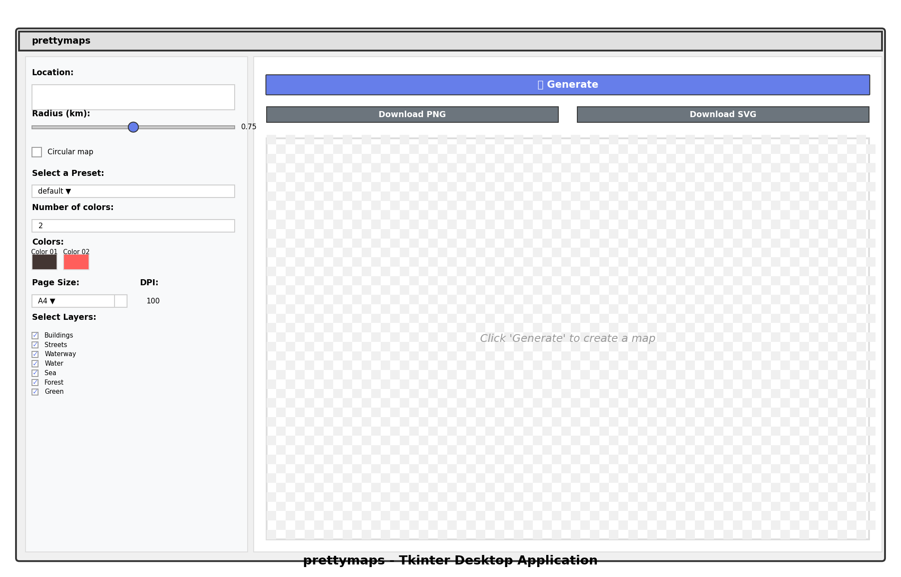

# prettymaps

A minimal Python library to draw customized maps from [OpenStreetMap](https://www.openstreetmap.org/#map=12/11.0733/106.3078) created using the [osmnx](https://github.com/gboeing/osmnx), [matplotlib](https://matplotlib.org/), [shapely](https://shapely.readthedocs.io/en/stable/index.html) and [vsketch](https://github.com/abey79/vsketch) packages.


# [](https://marceloprates.github.io/prettymaps/) [](https://pypi.org/project/prettymaps/) [](https://www.python.org/) [](LICENSE)


This work is [licensed](LICENSE) under a GNU Affero General Public License v3.0 (you can make commercial use, distribute and modify this project, but must **disclose** the source code with the license and copyright notice)

## Note about crediting and NFTs:
- Please keep the printed message on the figures crediting my repository and OpenStreetMap ([mandatory by their license](https://www.openstreetmap.org/copyright)).
- I am personally **against** NFTs for their [environmental impact](https://earth.org/nfts-environmental-impact/), the fact that they're a [giant money-laundering pyramid scheme](https://twitter.com/smdiehl/status/1445795667826208770) and the structural incentives they create for [theft](https://twitter.com/NFTtheft) in the open source and generative art communities.
- **I do not authorize in any way this project to be used for selling NFTs**, although I cannot legally enforce it. **Respect the creator**.
- The [AeternaCivitas](https://magiceden.io/marketplace/aeterna_civitas) and [geoartnft](https://www.geo-nft.com/) projects have used this work to sell NFTs and refused to credit it. See how they reacted after being exposed: [AeternaCivitas](https://github.com/marceloprates/prettymaps/raw/main/pictures/NFT_theft_AeternaCivitas.jpg), [geoartnft](https://github.com/marceloprates/prettymaps/raw/main/pictures/NFT_theft_geoart.jpg).
- **I have closed my other generative art projects on Github and won't be sharing new ones as open source to protect me from the NFT community**.

<a href='https://ko-fi.com/marceloprates_' target='_blank'></a>

## As seen on [Hacker News](https://web.archive.org/web/20210825160918/https://news.ycombinator.com/news):

## [prettymaps subreddit](https://www.reddit.com/r/prettymaps_/)
## [Google Colaboratory Demo](https://colab.research.google.com/github/marceloprates/prettymaps/blob/master/notebooks/examples.ipynb)

# Installation

### Install locally:
Install prettymaps with:

```
pip install prettymaps
```

### Install on Google Colaboratory:

Install prettymaps with:

```
!pip install -e "git+https://github.com/marceloprates/prettymaps#egg=prettymaps"
```

Then **restart the runtime** (Runtime -> Restart Runtime) before importing prettymaps

# Run front-end

## Tkinter Desktop Application (Recommended)

After prettymaps is installed, you can run the desktop application (Tkinter) from the prettymaps repository using:
```
python app_tkinter.py
```



The Tkinter version provides a native desktop experience with:
- ⚡ Faster startup (<1 second)
- 🖥️ Native system dialogs and widgets
- 📦 Can be packaged as standalone executable
- 💾 Lower resource usage (no browser required)

See [QUICKSTART_TKINTER.md](QUICKSTART_TKINTER.md) for detailed usage guide.

## Streamlit Web Application (Legacy)

You can also run the web-based Streamlit application. First, install the streamlit dependency:
```
pip install -r requirements_streamlit.txt
```

Then run:
```
streamlit run app.py
```

# Tutorial

Plotting with prettymaps is very simple. Run:
```python
prettymaps.plot(your_query)
```

**your_query** can be:
1. An address (Example: "Porto Alegre"),
2. Latitude / Longitude coordinates (Example: (-30.0324999, -51.2303767))
3. A custom boundary in GeoDataFrame format


```python
%reload_ext autoreload
%autoreload 2

import prettymaps

plot = prettymaps.plot('Stad van de Zon, Heerhugowaard, Netherlands')
```

    Fetching geodataframes took 14.43 seconds


    

    


You can also choose from different "presets" (parameter combinations saved in JSON files)

See below an example using the "minimal" preset


```python
import prettymaps

plot = prettymaps.plot(
    'Stad van de Zon, Heerhugowaard, Netherlands',
    preset = 'minimal'
)
```

    Fetching geodataframes took 5.48 seconds


    

    


Run

```python
prettymaps.presets()
```

to list all available presets:


```python
import prettymaps

prettymaps.presets()
```


<div>
<style scoped>
    .dataframe tbody tr th:only-of-type {
        vertical-align: middle;
    }

    .dataframe tbody tr th {
        vertical-align: top;
    }

    .dataframe thead th {
        text-align: right;
    }
</style>
<table border="1" class="dataframe">
  <thead>
    <tr style="text-align: right;">
      <th></th>
      <th>preset</th>
      <th>params</th>
    </tr>
  </thead>
  <tbody>
    <tr>
      <th>0</th>
      <td>abraca-redencao</td>
      <td>{'layers': {'perimeter': {}, 'streets': {'widt...</td>
    </tr>
    <tr>
      <th>1</th>
      <td>barcelona</td>
      <td>{'layers': {'perimeter': {'circle': False}, 's...</td>
    </tr>
    <tr>
      <th>2</th>
      <td>barcelona-plotter</td>
      <td>{'layers': {'streets': {'width': {'primary': 5...</td>
    </tr>
    <tr>
      <th>3</th>
      <td>cb-bf-f</td>
      <td>{'layers': {'streets': {'width': {'trunk': 6, ...</td>
    </tr>
    <tr>
      <th>4</th>
      <td>default</td>
      <td>{'layers': {'perimeter': {}, 'streets': {'widt...</td>
    </tr>
    <tr>
      <th>5</th>
      <td>heerhugowaard</td>
      <td>{'layers': {'perimeter': {}, 'streets': {'widt...</td>
    </tr>
    <tr>
      <th>6</th>
      <td>macao</td>
      <td>{'layers': {'perimeter': {}, 'streets': {'cust...</td>
    </tr>
    <tr>
      <th>7</th>
      <td>minimal</td>
      <td>{'layers': {'perimeter': {}, 'streets': {'widt...</td>
    </tr>
    <tr>
      <th>8</th>
      <td>plotter</td>
      <td>{'layers': {'perimeter': {}, 'streets': {'widt...</td>
    </tr>
    <tr>
      <th>9</th>
      <td>tijuca</td>
      <td>{'layers': {'perimeter': {}, 'streets': {'widt...</td>
    </tr>
  </tbody>
</table>
</div>


To examine a specific preset, run:


```python
import prettymaps

prettymaps.preset('default')
```


    Preset(params={'layers': {'perimeter': {}, 'streets': {'width': {'motorway': 5, 'trunk': 5, 'primary': 4.5, 'secondary': 4, 'tertiary': 3.5, 'cycleway': 3.5, 'residential': 3, 'service': 2, 'unclassified': 2, 'pedestrian': 2, 'footway': 1}}, 'waterway': {'tags': {'waterway': ['river', 'stream']}, 'width': {'river': 20, 'stream': 10}}, 'building': {'tags': {'building': True, 'landuse': 'construction'}}, 'water': {'tags': {'natural': ['water', 'bay']}}, 'sea': {}, 'forest': {'tags': {'landuse': 'forest'}}, 'green': {'tags': {'landuse': ['grass', 'orchard'], 'natural': ['island', 'wood', 'wetland'], 'leisure': ['dog_park', 'disc_golf_course', 'garden', 'golf_course', 'park', 'pitch', 'sports_centre', 'track']}}, 'rock': {'tags': {'natural': 'bare_rock'}}, 'beach': {'tags': {'natural': 'beach'}}, 'parking': {'tags': {'amenity': 'parking', 'highway': 'pedestrian', 'man_made': 'pier'}}}, 'style': {'perimeter': {'fill': False, 'lw': 0, 'zorder': 0}, 'background': {'fc': '#F2F4CB', 'zorder': -1}, 'green': {'fc': '#8BB174', 'ec': '#2F3737', 'hatch_c': '#A7C497', 'hatch': 'ooo...', 'lw': 1, 'zorder': 1}, 'forest': {'fc': '#64B96A', 'ec': '#2F3737', 'lw': 1, 'zorder': 2}, 'water': {'fc': '#a8e1e6', 'ec': '#2F3737', 'hatch_c': '#9bc3d4', 'hatch': 'ooo...', 'lw': 1, 'zorder': 99}, 'sea': {'fc': '#a8e1e6', 'ec': '#2F3737', 'hatch_c': '#9bc3d4', 'hatch': 'ooo...', 'lw': 1, 'zorder': 99}, 'waterway': {'fc': '#a8e1e6', 'ec': '#2F3737', 'hatch_c': '#9bc3d4', 'hatch': 'ooo...', 'lw': 1, 'zorder': 200}, 'beach': {'fc': '#FCE19C', 'ec': '#2F3737', 'hatch_c': '#d4d196', 'hatch': 'ooo...', 'lw': 1, 'zorder': 3}, 'parking': {'fc': '#F2F4CB', 'ec': '#2F3737', 'lw': 1, 'zorder': 3}, 'streets': {'fc': '#2F3737', 'ec': '#475657', 'alpha': 1, 'lw': 0, 'zorder': 4}, 'building': {'palette': ['#433633', '#FF5E5B'], 'ec': '#2F3737', 'lw': 0.5, 'zorder': 5}, 'rock': {'fc': '#BDC0BA', 'ec': '#2F3737', 'lw': 1, 'zorder': 6}}, 'circle': None, 'radius': 500})


Insted of using the default configuration you can customize several parameters. The most important are:

- layers: A dictionary of OpenStreetMap layers to fetch.
    - Keys: layer names (arbitrary)
    - Values: dicts representing OpenStreetMap queries
- style: Matplotlib style parameters
    - Keys: layer names (the same as before)
    - Values: dicts representing Matplotlib style parameters

```python
plot = prettymaps.plot(
    # Your query. Example: "Porto Alegre" or (-30.0324999, -51.2303767) (GPS coords)
    your_query,
    # Dict of OpenStreetMap Layers to plot. Example:
    # {'building': {'tags': {'building': True}}, 'water': {'tags': {'natural': 'water'}}}
    # Check the /presets folder for more examples
    layers,
    # Dict of style parameters for matplotlib. Example:
    # {'building': {'palette': ['#f00','#0f0','#00f'], 'edge_color': '#333'}}
    style,
    # Preset to load. Options include:
    # ['default', 'minimal', 'macao', 'tijuca']
    preset,
    # Save current parameters to a preset file.
    # Example: "my-preset" will save to "presets/my-preset.json"
    save_preset,
    # Whether to update loaded preset with additional provided parameters. Boolean
    update_preset,
    # Plot with circular boundary. Boolean
    circle,
    # Plot area radius. Float
    radius,
    # Dilate the boundary by this amount. Float
    dilate
)
```

**plot** is a python dataclass containing:

```python
@dataclass
class Plot:
    # A dictionary of GeoDataFrames (one for each plot layer)
    geodataframes: Dict[str, gp.GeoDataFrame]
    # A matplotlib figure
    fig: matplotlib.figure.Figure
    # A matplotlib axis object
    ax: matplotlib.axes.Axes
```

Here's an example of running prettymaps.plot() with customized parameters:


```python
import prettymaps

plot = prettymaps.plot(
    'Praça Ferreira do Amaral, Macau',
    circle = True,
    radius = 1100,
    layers = {
        "green": {
            "tags": {
                "landuse": "grass",
                "natural": ["island", "wood"],
                "leisure": "park"
            }
        },
        "forest": {
            "tags": {
                "landuse": "forest"
            }
        },
        "water": {
            "tags": {
                "natural": ["water", "bay"]
            }
        },
        "parking": {
            "tags": {
                "amenity": "parking",
                "highway": "pedestrian",
                "man_made": "pier"
            }
        },
        "streets": {
            "width": {
                "motorway": 5,
                "trunk": 5,
                "primary": 4.5,
                "secondary": 4,
                "tertiary": 3.5,
                "residential": 3,
            }
        },
        "building": {
            "tags": {"building": True},
        },
    },
    style = {
        "background": {
            "fc": "#F2F4CB",
            "ec": "#dadbc1",
            "hatch": "ooo...",
        },
        "perimeter": {
            "fc": "#F2F4CB",
            "ec": "#dadbc1",
            "lw": 0,
            "hatch": "ooo...",
        },
        "green": {
            "fc": "#D0F1BF",
            "ec": "#2F3737",
            "lw": 1,
        },
        "forest": {
            "fc": "#64B96A",
            "ec": "#2F3737",
            "lw": 1,
        },
        "water": {
            "fc": "#a1e3ff",
            "ec": "#2F3737",
            "hatch": "ooo...",
            "hatch_c": "#85c9e6",
            "lw": 1,
        },
        "parking": {
            "fc": "#F2F4CB",
            "ec": "#2F3737",
            "lw": 1,
        },
        "streets": {
            "fc": "#2F3737",
            "ec": "#475657",
            "alpha": 1,
            "lw": 0,
        },
        "building": {
            "palette": [
                "#FFC857",
                "#E9724C",
                "#C5283D"
            ],
            "ec": "#2F3737",
            "lw": 0.5,
        }
    }
)
```

    Fetching geodataframes took 20.74 seconds


    

    


In order to plot an entire region and not just a rectangular or circular area, set

```python
radius = False
```


```python
import prettymaps

plot = prettymaps.plot(
    'Bom Fim, Porto Alegre, Brasil', radius = False,
)
```

    Fetching geodataframes took 14.80 seconds


    

    


You can access layers's GeoDataFrames directly like this:


```python
import prettymaps

# Run prettymaps in show = False mode (we're only interested in obtaining the GeoDataFrames)
plot = prettymaps.plot('Centro Histórico, Porto Alegre', show = False)
plot.geodataframes['building']
```

    Fetching geodataframes took 14.56 seconds


<div>
<style scoped>
    .dataframe tbody tr th:only-of-type {
        vertical-align: middle;
    }

    .dataframe tbody tr th {
        vertical-align: top;
    }

    .dataframe thead th {
        text-align: right;
    }
</style>
<table border="1" class="dataframe">
  <thead>
    <tr style="text-align: right;">
      <th></th>
      <th>geometry</th>
      <th>bicycle</th>
      <th>highway</th>
      <th>leisure</th>
      <th>addr:housenumber</th>
      <th>addr:street</th>
      <th>amenity</th>
      <th>operator</th>
      <th>website</th>
      <th>check_date</th>
      <th>...</th>
      <th>payment:lightning_contactless</th>
      <th>payment:onchain</th>
      <th>bus</th>
      <th>smoothness</th>
      <th>inscription</th>
      <th>type</th>
      <th>boat</th>
      <th>name:fr</th>
      <th>building:part</th>
      <th>architect</th>
    </tr>
  </thead>
  <tbody>
    <tr>
      <th>(node, 2407915698)</th>
      <td>POINT (-51.23212 -30.0367)</td>
      <td>NaN</td>
      <td>NaN</td>
      <td>NaN</td>
      <td>820</td>
      <td>Rua Washington Luiz</td>
      <td>NaN</td>
      <td>NaN</td>
      <td>NaN</td>
      <td>NaN</td>
      <td>...</td>
      <td>NaN</td>
      <td>NaN</td>
      <td>NaN</td>
      <td>NaN</td>
      <td>NaN</td>
      <td>NaN</td>
      <td>NaN</td>
      <td>NaN</td>
      <td>NaN</td>
      <td>NaN</td>
    </tr>
    <tr>
      <th>(relation, 2798271)</th>
      <td>POLYGON ((-51.23097 -30.03377, -51.2309 -30.03...</td>
      <td>NaN</td>
      <td>NaN</td>
      <td>NaN</td>
      <td>NaN</td>
      <td>Praça Marechal Deodoro</td>
      <td>NaN</td>
      <td>NaN</td>
      <td>https://www.estado.rs.gov.br/</td>
      <td>NaN</td>
      <td>...</td>
      <td>NaN</td>
      <td>NaN</td>
      <td>NaN</td>
      <td>NaN</td>
      <td>NaN</td>
      <td>multipolygon</td>
      <td>NaN</td>
      <td>Palais Piratini</td>
      <td>NaN</td>
      <td>NaN</td>
    </tr>
    <tr>
      <th>(relation, 2895718)</th>
      <td>POLYGON ((-51.23445 -30.03076, -51.23441 -30.0...</td>
      <td>NaN</td>
      <td>NaN</td>
      <td>NaN</td>
      <td>736</td>
      <td>Rua dos Andradas</td>
      <td>arts_centre</td>
      <td>NaN</td>
      <td>https://www.ccmq.com.br/</td>
      <td>NaN</td>
      <td>...</td>
      <td>NaN</td>
      <td>NaN</td>
      <td>NaN</td>
      <td>NaN</td>
      <td>NaN</td>
      <td>multipolygon</td>
      <td>NaN</td>
      <td>NaN</td>
      <td>no</td>
      <td>NaN</td>
    </tr>
    <tr>
      <th>(relation, 3532262)</th>
      <td>POLYGON ((-51.22935 -30.03693, -51.22923 -30.0...</td>
      <td>NaN</td>
      <td>NaN</td>
      <td>NaN</td>
      <td>NaN</td>
      <td>NaN</td>
      <td>NaN</td>
      <td>NaN</td>
      <td>NaN</td>
      <td>NaN</td>
      <td>...</td>
      <td>NaN</td>
      <td>NaN</td>
      <td>NaN</td>
      <td>NaN</td>
      <td>NaN</td>
      <td>multipolygon</td>
      <td>NaN</td>
      <td>NaN</td>
      <td>NaN</td>
      <td>NaN</td>
    </tr>
    <tr>
      <th>(relation, 3532263)</th>
      <td>POLYGON ((-51.22916 -30.037, -51.22903 -30.036...</td>
      <td>NaN</td>
      <td>NaN</td>
      <td>NaN</td>
      <td>NaN</td>
      <td>NaN</td>
      <td>parking</td>
      <td>NaN</td>
      <td>NaN</td>
      <td>NaN</td>
      <td>...</td>
      <td>NaN</td>
      <td>NaN</td>
      <td>NaN</td>
      <td>NaN</td>
      <td>NaN</td>
      <td>multipolygon</td>
      <td>NaN</td>
      <td>NaN</td>
      <td>NaN</td>
      <td>NaN</td>
    </tr>
    <tr>
      <th>...</th>
      <td>...</td>
      <td>...</td>
      <td>...</td>
      <td>...</td>
      <td>...</td>
      <td>...</td>
      <td>...</td>
      <td>...</td>
      <td>...</td>
      <td>...</td>
      <td>...</td>
      <td>...</td>
      <td>...</td>
      <td>...</td>
      <td>...</td>
      <td>...</td>
      <td>...</td>
      <td>...</td>
      <td>...</td>
      <td>...</td>
      <td>...</td>
    </tr>
    <tr>
      <th>(way, 1082776706)</th>
      <td>POLYGON ((-51.22975 -30.02912, -51.22974 -30.0...</td>
      <td>NaN</td>
      <td>NaN</td>
      <td>NaN</td>
      <td>NaN</td>
      <td>NaN</td>
      <td>NaN</td>
      <td>NaN</td>
      <td>NaN</td>
      <td>NaN</td>
      <td>...</td>
      <td>NaN</td>
      <td>NaN</td>
      <td>NaN</td>
      <td>NaN</td>
      <td>NaN</td>
      <td>NaN</td>
      <td>NaN</td>
      <td>NaN</td>
      <td>NaN</td>
      <td>NaN</td>
    </tr>
    <tr>
      <th>(way, 1082776707)</th>
      <td>POLYGON ((-51.22992 -30.02954, -51.22987 -30.0...</td>
      <td>NaN</td>
      <td>NaN</td>
      <td>NaN</td>
      <td>NaN</td>
      <td>NaN</td>
      <td>NaN</td>
      <td>NaN</td>
      <td>NaN</td>
      <td>NaN</td>
      <td>...</td>
      <td>NaN</td>
      <td>NaN</td>
      <td>NaN</td>
      <td>NaN</td>
      <td>NaN</td>
      <td>NaN</td>
      <td>NaN</td>
      <td>NaN</td>
      <td>NaN</td>
      <td>NaN</td>
    </tr>
    <tr>
      <th>(way, 1082787655)</th>
      <td>POLYGON ((-51.22601 -30.03038, -51.22602 -30.0...</td>
      <td>NaN</td>
      <td>NaN</td>
      <td>NaN</td>
      <td>NaN</td>
      <td>NaN</td>
      <td>NaN</td>
      <td>NaN</td>
      <td>NaN</td>
      <td>NaN</td>
      <td>...</td>
      <td>NaN</td>
      <td>NaN</td>
      <td>NaN</td>
      <td>NaN</td>
      <td>NaN</td>
      <td>NaN</td>
      <td>NaN</td>
      <td>NaN</td>
      <td>NaN</td>
      <td>NaN</td>
    </tr>
    <tr>
      <th>(way, 1354523569)</th>
      <td>POLYGON ((-51.23248 -30.03341, -51.23244 -30.0...</td>
      <td>NaN</td>
      <td>NaN</td>
      <td>NaN</td>
      <td>NaN</td>
      <td>NaN</td>
      <td>pharmacy</td>
      <td>NaN</td>
      <td>NaN</td>
      <td>NaN</td>
      <td>...</td>
      <td>NaN</td>
      <td>NaN</td>
      <td>NaN</td>
      <td>NaN</td>
      <td>NaN</td>
      <td>NaN</td>
      <td>NaN</td>
      <td>NaN</td>
      <td>NaN</td>
      <td>NaN</td>
    </tr>
    <tr>
      <th>(way, 1423336172)</th>
      <td>POLYGON ((-51.23399 -30.03092, -51.23389 -30.0...</td>
      <td>NaN</td>
      <td>NaN</td>
      <td>NaN</td>
      <td>788</td>
      <td>Rua dos Andradas</td>
      <td>NaN</td>
      <td>NaN</td>
      <td>NaN</td>
      <td>NaN</td>
      <td>...</td>
      <td>NaN</td>
      <td>NaN</td>
      <td>NaN</td>
      <td>NaN</td>
      <td>NaN</td>
      <td>NaN</td>
      <td>NaN</td>
      <td>NaN</td>
      <td>NaN</td>
      <td>NaN</td>
    </tr>
  </tbody>
</table>
<p>2415 rows × 137 columns</p>
</div>


Search a building by name and display it:


```python
plot.geodataframes['building'][
        plot.geodataframes['building'].name == 'Catedral Metropolitana Nossa Senhora Mãe de Deus'
].geometry[0]
```

    /opt/hostedtoolcache/Python/3.12.11/x64/lib/python3.12/site-packages/geopandas/geoseries.py:772: FutureWarning: Series.__getitem__ treating keys as positions is deprecated. In a future version, integer keys will always be treated as labels (consistent with DataFrame behavior). To access a value by position, use `ser.iloc[pos]`
      val = getattr(super(), mtd)(*args, **kwargs)


    

    


Plot mosaic of building footprints


```python
import prettymaps
import numpy as np
import osmnx as ox
from matplotlib import pyplot as plt

# Run prettymaps in show = False mode (we're only interested in obtaining the GeoDataFrames)
plot = prettymaps.plot('Porto Alegre', show = False)
# Get list of buildings from plot's geodataframes dict
buildings = plot.geodataframes['building']
# Project from lat / long
buildings = ox.projection.project_gdf(buildings)
buildings = [b for b in buildings.geometry if b.area > 0]

# Draw Matplotlib mosaic of n x n building footprints
n = 6
fig,axes = plt.subplots(n,n, figsize = (7,6))
# Set background color
fig.patch.set_facecolor('#5cc0eb')
# Figure title
fig.suptitle(
    'Buildings of Porto Alegre',
    size = 25,
    color = '#fff'
)
# Draw each building footprint on a separate axis
for ax,building in zip(np.concatenate(axes),buildings):
    ax.plot(*building.exterior.xy, c = '#ffffff')
    ax.autoscale(); ax.axis('off'); ax.axis('equal')
```

    Fetching geodataframes took 16.54 seconds


    

    


Access plot.ax or plot.fig to add new elements to the matplotlib plot: 


```python
import prettymaps

plot = prettymaps.plot(
    (41.39491,2.17557),
    preset = 'barcelona',
    show = False # We don't want to render the map yet
)

# Change background color
plot.fig.patch.set_facecolor('#F2F4CB')
# Add title
_ = plot.ax.set_title(
    'Barcelona',
    font = 'serif',
    size = 50
)
```

    Fetching geodataframes took 12.52 seconds


Use **plotter** mode to export a pen plotter-compatible SVG (thanks to abey79's amazing [vsketch](https://github.com/abey79/vsketch) library)


```python
import prettymaps

plot = prettymaps.plot(
    (41.39491,2.17557),
    mode = 'plotter',
    layers = dict(perimeter = {}),
    preset = 'barcelona-plotter',
    scale_x = .6,
    scale_y = -.6,
)
```

    Fetching geodataframes took 4.82 seconds


    

    


Some other examples


```python
import prettymaps

plot = prettymaps.plot(
    'Barra da Tijuca',
    dilate = 0,
    figsize = (22,10),
    preset = 'tijuca',
    adjust_aspect_ratio = False
)
```

    Fetching geodataframes took 23.53 seconds


    

    


Use prettymaps.create_preset() to create a preset:


```python
import prettymaps

prettymaps.create_preset(
    "my-preset",
    layers = {
        "building": {
            "tags": {
                "building": True,
                "leisure": [
                    "track",
                    "pitch"
                ]
            }
        },
        "streets": {
            "width": {
                "trunk": 6,
                "primary": 6,
                "secondary": 5,
                "tertiary": 4,
                "residential": 3.5,
                "pedestrian": 3,
                "footway": 3,
                "path": 3
            }
        },
    },
    style = {
        "perimeter": {
            "fill": False,
            "lw": 0,
            "zorder": 0
        },
        "streets": {
            "fc": "#F1E6D0",
            "ec": "#2F3737",
            "lw": 1.5,
            "zorder": 3
        },
        "building": {
            "palette": [
                "#fff"
            ],
            "ec": "#2F3737",
            "lw": 1,
            "zorder": 4
        }
    }
)

prettymaps.preset('my-preset')
```


    Preset(params={'layers': {'building': {'tags': {'building': True, 'leisure': ['track', 'pitch']}}, 'streets': {'width': {'trunk': 6, 'primary': 6, 'secondary': 5, 'tertiary': 4, 'residential': 3.5, 'pedestrian': 3, 'footway': 3, 'path': 3}}}, 'style': {'perimeter': {'fill': False, 'lw': 0, 'zorder': 0}, 'streets': {'fc': '#F1E6D0', 'ec': '#2F3737', 'lw': 1.5, 'zorder': 3}, 'building': {'palette': ['#fff'], 'ec': '#2F3737', 'lw': 1, 'zorder': 4}}, 'circle': None, 'radius': None, 'dilate': None})


Use **prettymaps.multiplot** and **prettymaps.Subplot** to draw multiple regions on the same canvas


```python
import prettymaps

# Draw several regions on the same canvas
plot = prettymaps.multiplot(
    prettymaps.Subplot(
        'Cidade Baixa, Porto Alegre',
        style={'building': {'palette': ['#49392C', '#E1F2FE', '#98D2EB']}}
    ),
    prettymaps.Subplot(
        'Bom Fim, Porto Alegre',
        style={'building': {'palette': ['#BA2D0B', '#D5F2E3', '#73BA9B', '#F79D5C']}}
    ),
    prettymaps.Subplot(
        'Farroupilha, Porto Alegre',
        layers = {'building': {'tags': {'building': True}}},
        style={'building': {'palette': ['#EEE4E1', '#E7D8C9', '#E6BEAE']}}
    ),
    # Load a global preset
    preset='cb-bf-f',
    # Figure size
    figsize=(12, 12)
)
```

    Fetching geodataframes took 8.95 seconds


    Fetching geodataframes took 7.03 seconds


    Fetching geodataframes took 8.45 seconds


    

    


# Add hillshade


```python
plot = prettymaps.plot(
    'Honolulu',
    radius = 5500,
    figsize = 'a4',
    layers = {'hillshade': {
        'azdeg': 315,
        'altdeg': 45,
        'vert_exag': 1,
        'dx': 1,
        'dy': 1,
        'alpha': 0.75,
    }},
)
```

    Fetching geodataframes took 37.53 seconds


    make: Entering directory '/home/runner/work/prettymaps/prettymaps/notebooks/SRTM1'
    curl -s -o spool/N21/N21W158.hgt.gz.temp https://s3.amazonaws.com/elevation-tiles-prod/skadi/N21/N21W158.hgt.gz && mv spool/N21/N21W158.hgt.gz.temp spool/N21/N21W158.hgt.gz


    gunzip spool/N21/N21W158.hgt.gz 2>/dev/null || touch spool/N21/N21W158.hgt
    gdal_translate -q -co TILED=YES -co COMPRESS=DEFLATE -co ZLEVEL=9 -co PREDICTOR=2 spool/N21/N21W158.hgt cache/N21/N21W158.tif 2>/dev/null || touch cache/N21/N21W158.tif


    rm spool/N21/N21W158.hgt
    make: Leaving directory '/home/runner/work/prettymaps/prettymaps/notebooks/SRTM1'
    make: Entering directory '/home/runner/work/prettymaps/prettymaps/notebooks/SRTM1'
    gdalbuildvrt -q -overwrite SRTM1.vrt cache/N21/N21W158.tif
    make: Leaving directory '/home/runner/work/prettymaps/prettymaps/notebooks/SRTM1'
    make: Entering directory '/home/runner/work/prettymaps/prettymaps/notebooks/SRTM1'
    cp SRTM1.vrt SRTM1.3faa36cc8cab4dfda9edabe3b5a4ddc1.vrt
    make: Leaving directory '/home/runner/work/prettymaps/prettymaps/notebooks/SRTM1'
    make: Entering directory '/home/runner/work/prettymaps/prettymaps/notebooks/SRTM1'
    gdal_translate -q -co TILED=YES -co COMPRESS=DEFLATE -co ZLEVEL=9 -co PREDICTOR=2 -projwin -157.90125854957773 21.364471426268267 -157.81006761682832 21.244615177105388 SRTM1.3faa36cc8cab4dfda9edabe3b5a4ddc1.vrt /home/runner/work/prettymaps/prettymaps/notebooks/elevation.tif
    rm -f SRTM1.3faa36cc8cab4dfda9edabe3b5a4ddc1.vrt
    make: Leaving directory '/home/runner/work/prettymaps/prettymaps/notebooks/SRTM1'


    WARNING:matplotlib.axes._base:Ignoring fixed y limits to fulfill fixed data aspect with adjustable data limits.


    

    


# Add keypoints


```python
plot = prettymaps.plot(
    'Garopaba',
    radius = 5000,
    figsize = 'a4',
    layers = {'building': False},
    keypoints = {
        # Search for general keypoints specified by OSM tags
        'tags': {'natural': ['beach']},
        # Or, search by specific name or free-text search
        # pretymaps will use a fuzzy string matching to search for the specified name
        'specific': {
            'pedra branca': {'tags': {'natural': ['peak']}},
        }
    },
)
```

    Fetching geodataframes took 17.09 seconds


    

    

