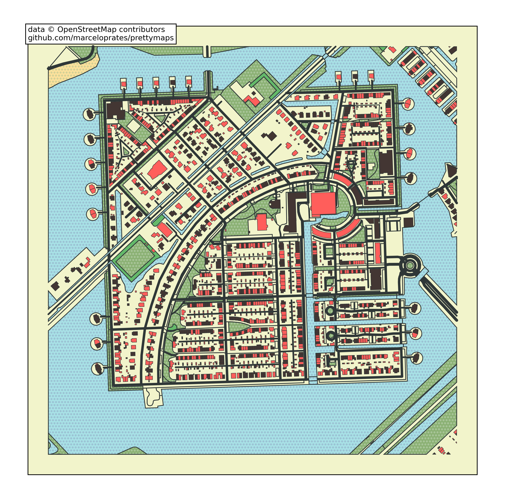
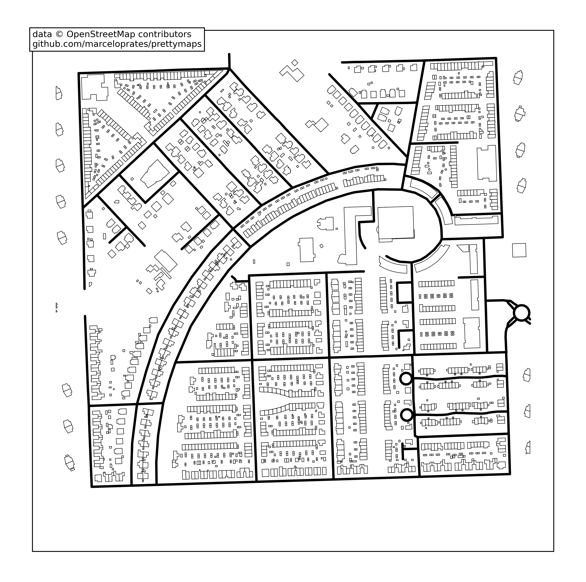
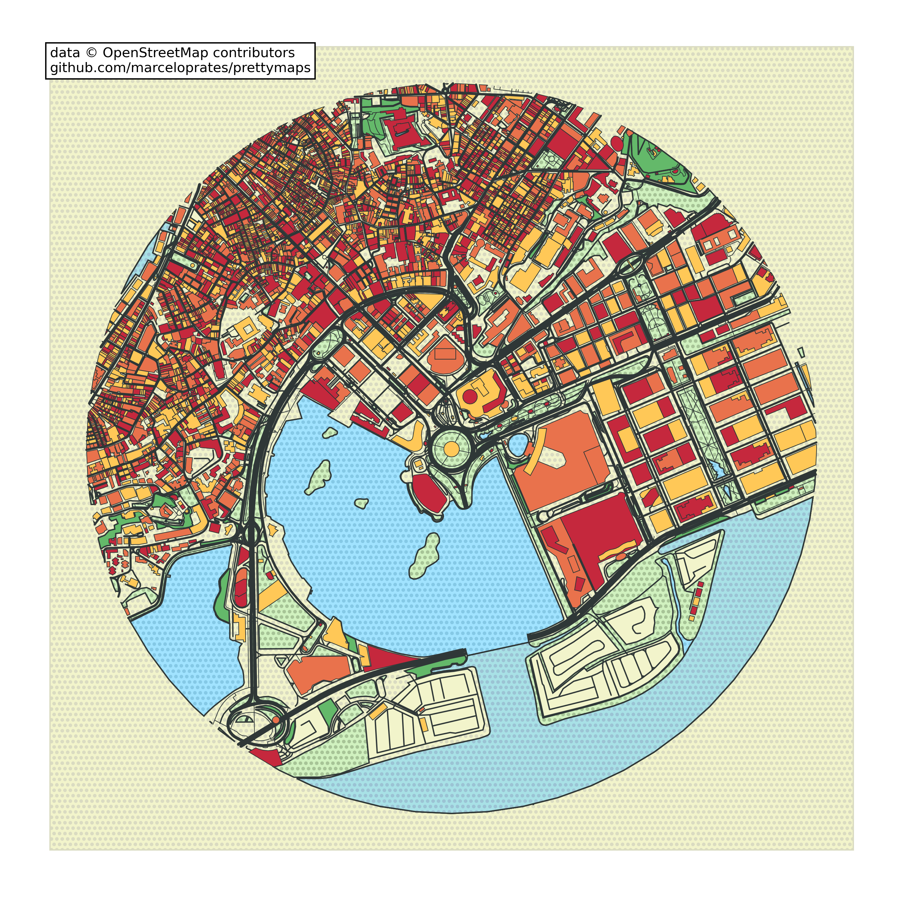
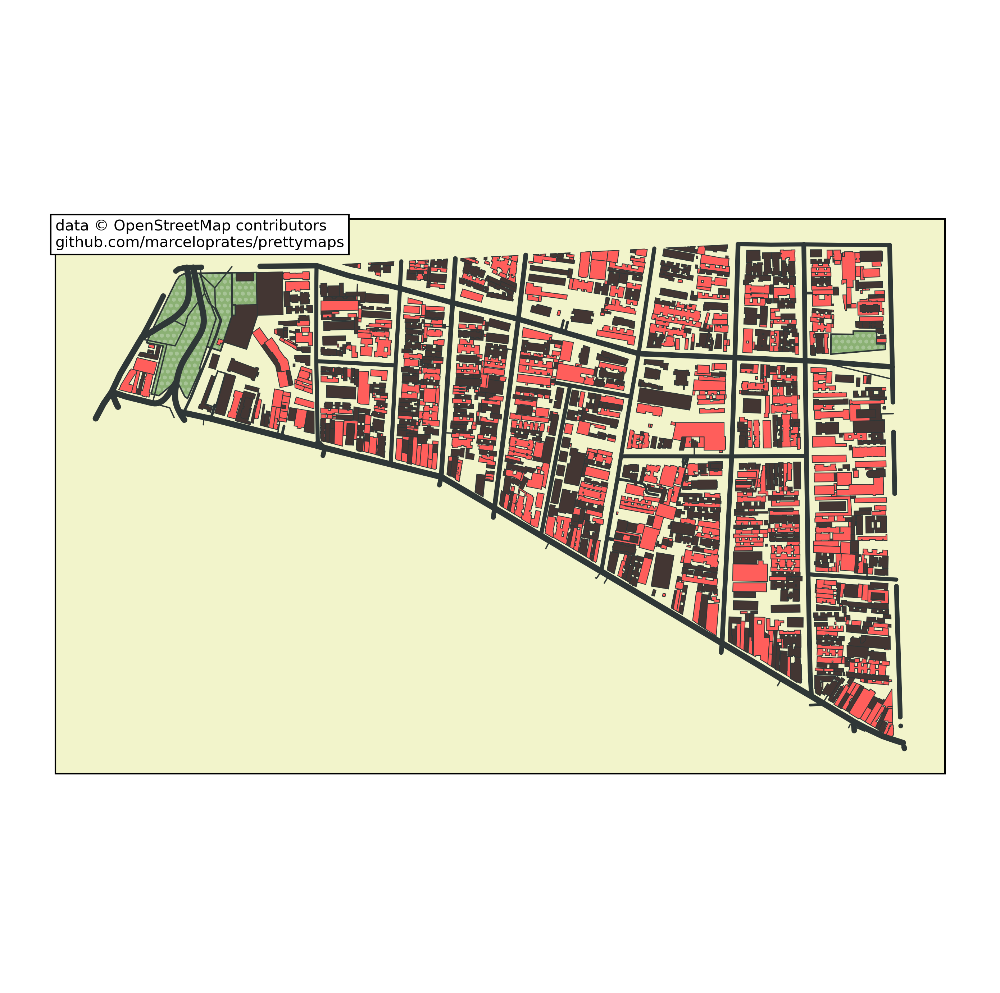
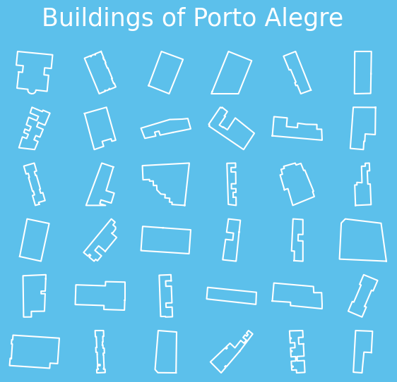
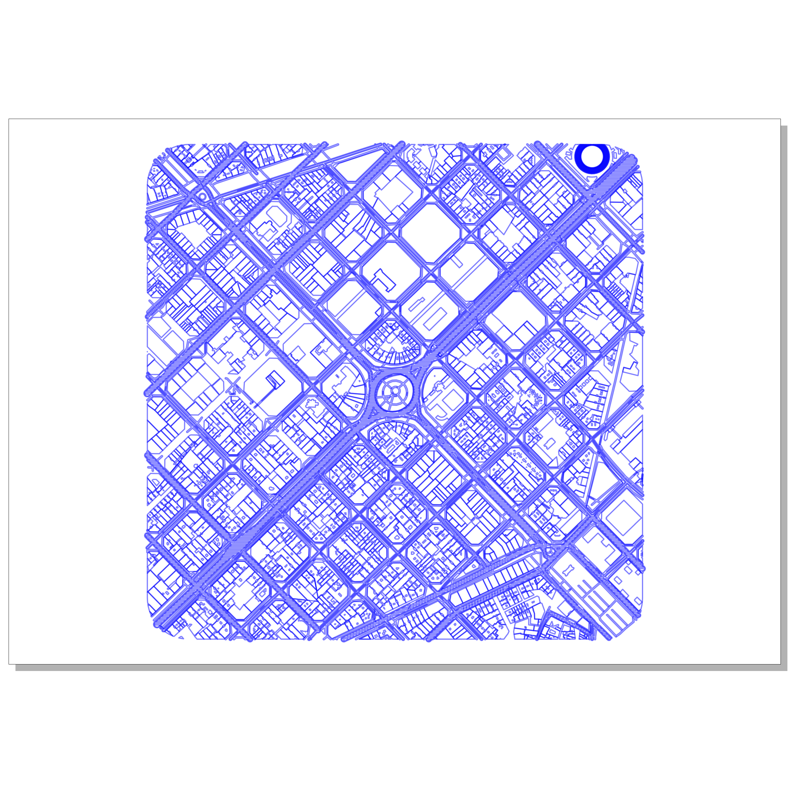
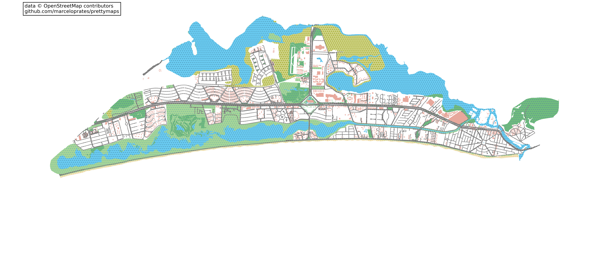
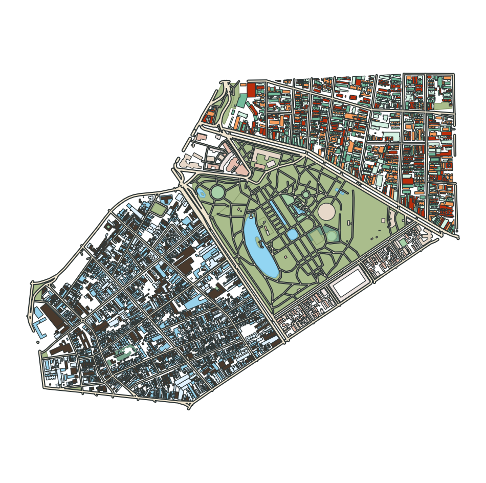
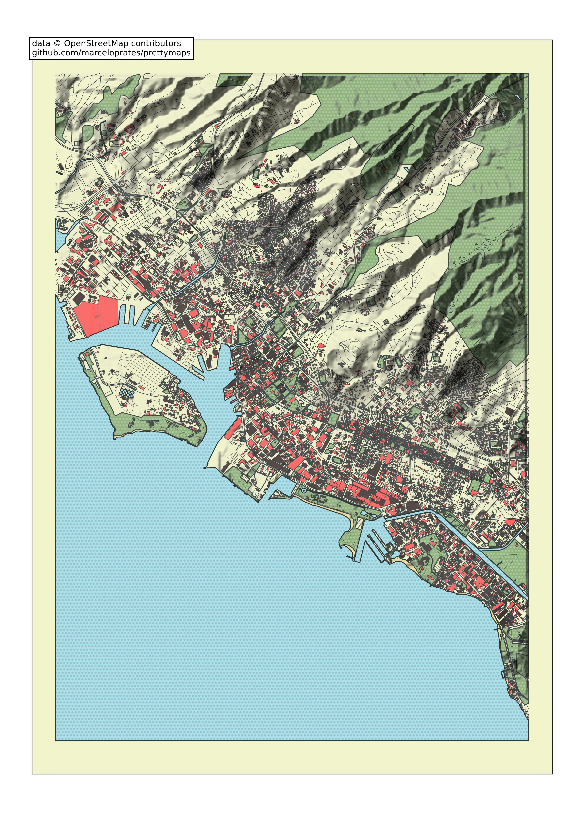
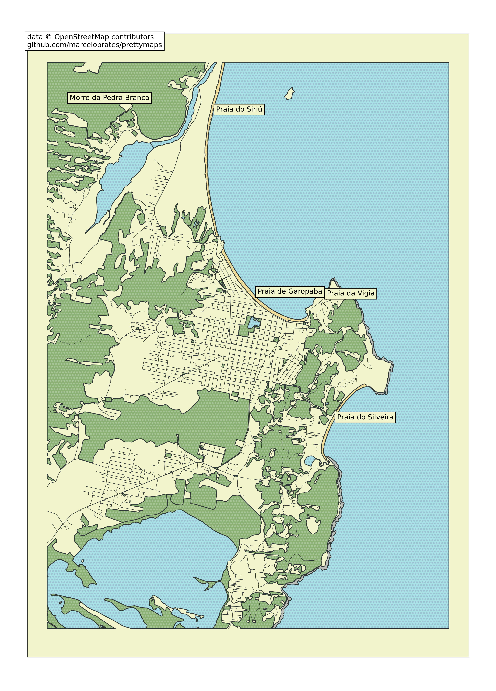

# prettymaps Tutorial

A minimal Python library to draw customized maps from [OpenStreetMap](https://www.openstreetmap.org) created using the [osmnx](https://github.com/gboeing/osmnx), [matplotlib](https://matplotlib.org/), [shapely](https://shapely.readthedocs.io) and [vsketch](https://github.com/abey79/vsketch) packages.



This tutorial is generated from [`notebooks/tutorial.py`](../notebooks/tutorial.py), a marimo notebook. To run it interactively:

```sh
uv run --with marimo marimo edit notebooks/tutorial.py
```

Or with the locally installed copy:

```sh
.venv/bin/marimo edit notebooks/tutorial.py
```

## Installation

### Install locally

```
pip install prettymaps
```

### Install on Google Colaboratory

```
!pip install -e "git+https://github.com/marceloprates/prettymaps#egg=prettymaps"
```

Then **restart the runtime** (Runtime -> Restart Runtime) before importing prettymaps.

## Run front-end

After prettymaps is installed, you can run the front-end (streamlit) application from the prettymaps repository using:

```
streamlit run app.py
```

## Plotting

Plotting with prettymaps is very simple. Run:

```python
prettymaps.plot(your_query)
```

**`your_query`** can be:

1. An address (Example: `"Porto Alegre"`),
2. Latitude / Longitude coordinates (Example: `(-30.0324999, -51.2303767)`),
3. A custom boundary in GeoDataFrame format.

### Default preset

```python
import prettymaps

plot = prettymaps.plot('Stad van de Zon, Heerhugowaard, Netherlands')
```


### Presets

You can also choose from different "presets" (parameter combinations saved in JSON files). See below an example using the "minimal" preset:

```python
plot = prettymaps.plot(
    'Stad van de Zon, Heerhugowaard, Netherlands',
    preset='minimal',
)
```



Run `prettymaps.presets()` to list all available presets. To inspect a specific preset, run `prettymaps.preset('default')`.

### Customizing parameters

Instead of using the default configuration you can customize several parameters. The most important are:

- **`layers`** — A dictionary of OpenStreetMap layers to fetch.
  - Keys: layer names (arbitrary)
  - Values: dicts representing OpenStreetMap queries
- **`style`** — Matplotlib style parameters
  - Keys: layer names (the same as before)
  - Values: dicts representing Matplotlib style parameters

```python
plot = prettymaps.plot(
    your_query,
    layers,
    style,
    preset,
    save_preset,
    update_preset,
    circle,
    radius,
    dilate,
)
```

`plot` is a Python dataclass containing:

```python
@dataclass
class Plot:
    geodataframes: Dict[str, gp.GeoDataFrame]
    fig: matplotlib.figure.Figure
    ax: matplotlib.axes.Axes
```

Here's an example of running `prettymaps.plot()` with customized parameters (Macau):

```python
plot = prettymaps.plot(
    'Praça Ferreira do Amaral, Macau',
    circle=True,
    radius=1100,
    layers={
        "green": {
            "tags": {
                "landuse": "grass",
                "natural": ["island", "wood"],
                "leisure": "park",
            }
        },
        "forest": {"tags": {"landuse": "forest"}},
        "water": {"tags": {"natural": ["water", "bay"]}},
        "parking": {
            "tags": {
                "amenity": "parking",
                "highway": "pedestrian",
                "man_made": "pier",
            }
        },
        "streets": {
            "width": {
                "motorway": 5, "trunk": 5, "primary": 4.5,
                "secondary": 4, "tertiary": 3.5, "residential": 3,
            }
        },
        "building": {"tags": {"building": True}},
    },
    style={
        "background": {"fc": "#F2F4CB", "ec": "#dadbc1", "hatch": "ooo..."},
        "perimeter": {"fc": "#F2F4CB", "ec": "#dadbc1", "lw": 0, "hatch": "ooo..."},
        "green": {"fc": "#D0F1BF", "ec": "#2F3737", "lw": 1},
        "forest": {"fc": "#64B96A", "ec": "#2F3737", "lw": 1},
        "water": {
            "fc": "#a1e3ff", "ec": "#2F3737",
            "hatch": "ooo...", "hatch_c": "#85c9e6", "lw": 1,
        },
        "parking": {"fc": "#F2F4CB", "ec": "#2F3737", "lw": 1},
        "streets": {"fc": "#2F3737", "ec": "#475657", "alpha": 1, "lw": 0},
        "building": {
            "palette": ["#FFC857", "#E9724C", "#C5283D"],
            "ec": "#2F3737", "lw": 0.5,
        },
    },
)
```



### Plot an entire region

To plot an entire region (not just a rectangular or circular area), set `radius=False`:

```python
plot = prettymaps.plot('Bom Fim, Porto Alegre, Brasil', radius=False)
```



### Access GeoDataFrames directly

You can access a layer's GeoDataFrame directly:

```python
plot = prettymaps.plot('Centro Histórico, Porto Alegre', show=False)
plot.geodataframes['building']
```

### Search by name

Search a building by name and display it:

```python
plot.geodataframes['building'][
    plot.geodataframes['building'].name
    == 'Catedral Metropolitana Nossa Senhora Mãe de Deus'
].geometry[0]
```

### Mosaic of building footprints

```python
import numpy as np
import osmnx as ox
from matplotlib import pyplot as plt

plot = prettymaps.plot('Porto Alegre', show=False)
buildings = plot.geodataframes['building']
buildings = ox.projection.project_gdf(buildings)
buildings = [b for b in buildings.geometry if b.area > 0]

n = 6
fig, axes = plt.subplots(n, n, figsize=(7, 6))
fig.patch.set_facecolor('#5cc0eb')
fig.suptitle('Buildings of Porto Alegre', size=25, color='#fff')
for ax, building in zip(np.concatenate(axes), buildings):
    ax.plot(*building.exterior.xy, c='#ffffff')
    ax.autoscale(); ax.axis('off'); ax.axis('equal')
```



### Customizing the matplotlib axes

Access `plot.ax` or `plot.fig` to add new elements to the matplotlib plot:

```python
plot = prettymaps.plot(
    (41.39491, 2.17557),
    preset='barcelona',
    show=False,
)

plot.fig.patch.set_facecolor('#F2F4CB')
plot.ax.set_title('Barcelona', font='serif', size=50)
```

### Plotter mode

Use **plotter** mode to export a pen plotter-compatible SVG (thanks to abey79's amazing [vsketch](https://github.com/abey79/vsketch) library):

```python
plot = prettymaps.plot(
    (41.39491, 2.17557),
    mode='plotter',
    layers=dict(perimeter={}),
    preset='barcelona-plotter',
    scale_x=0.6,
    scale_y=-0.6,
)
```



### Other examples

```python
plot = prettymaps.plot(
    'Barra da Tijuca',
    dilate=0,
    figsize=(22, 10),
    preset='tijuca',
    adjust_aspect_ratio=False,
)
```



### Create a preset

Use `prettymaps.create_preset()` to create a preset:

```python
prettymaps.create_preset(
    "my-preset",
    layers={
        "building": {
            "tags": {"building": True, "leisure": ["track", "pitch"]},
        },
        "streets": {
            "width": {
                "trunk": 6, "primary": 6, "secondary": 5,
                "tertiary": 4, "residential": 3.5,
                "pedestrian": 3, "footway": 3, "path": 3,
            }
        },
    },
    style={
        "perimeter": {"fill": False, "lw": 0, "zorder": 0},
        "streets": {"fc": "#F1E6D0", "ec": "#2F3737", "lw": 1.5, "zorder": 3},
        "building": {"palette": ["#fff"], "ec": "#2F3737", "lw": 1, "zorder": 4},
    },
)

prettymaps.preset('my-preset')
```

### Multiplot

Use `prettymaps.multiplot` and `prettymaps.Subplot` to draw multiple regions on the same canvas:

```python
plot = prettymaps.multiplot(
    prettymaps.Subplot(
        'Cidade Baixa, Porto Alegre',
        style={'building': {'palette': ['#49392C', '#E1F2FE', '#98D2EB']}},
    ),
    prettymaps.Subplot(
        'Bom Fim, Porto Alegre',
        style={'building': {'palette': ['#BA2D0B', '#D5F2E3', '#73BA9B', '#F79D5C']}},
    ),
    prettymaps.Subplot(
        'Farroupilha, Porto Alegre',
        layers={'building': {'tags': {'building': True}}},
        style={'building': {'palette': ['#EEE4E1', '#E7D8C9', '#E6BEAE']}},
    ),
    preset='cb-bf-f',
    figsize=(12, 12),
)
```



### Add hillshade

```python
plot = prettymaps.plot(
    'Honolulu',
    radius=5500,
    figsize='a4',
    layers={
        'hillshade': {
            'azdeg': 315,
            'altdeg': 45,
            'vert_exag': 1,
            'dx': 1,
            'dy': 1,
            'alpha': 0.75,
        },
    },
)
```



### Add keypoints

```python
plot = prettymaps.plot(
    'Garopaba',
    radius=5000,
    figsize='a4',
    layers={'building': False},
    keypoints={
        'tags': {'natural': ['beach']},
        'specific': {
            'pedra branca': {'tags': {'natural': ['peak']}},
        },
    },
)
```


